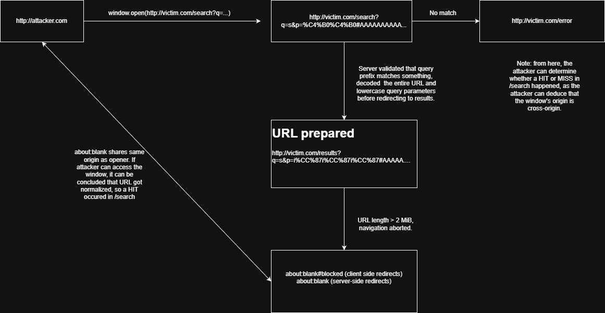
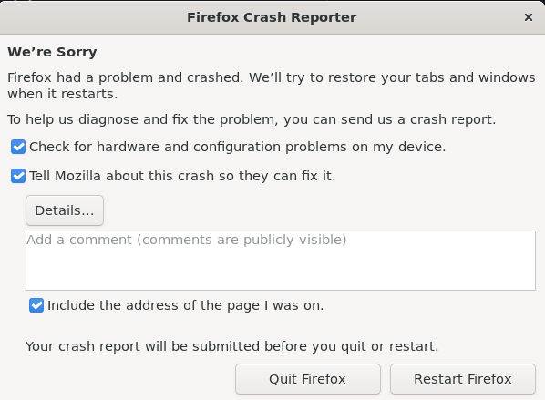
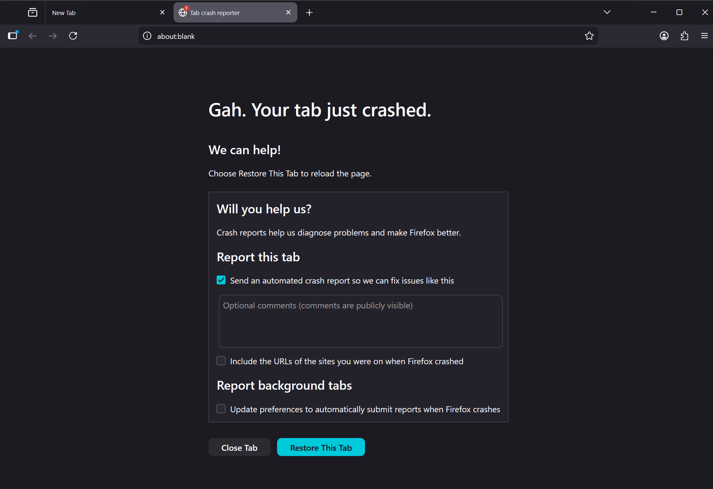
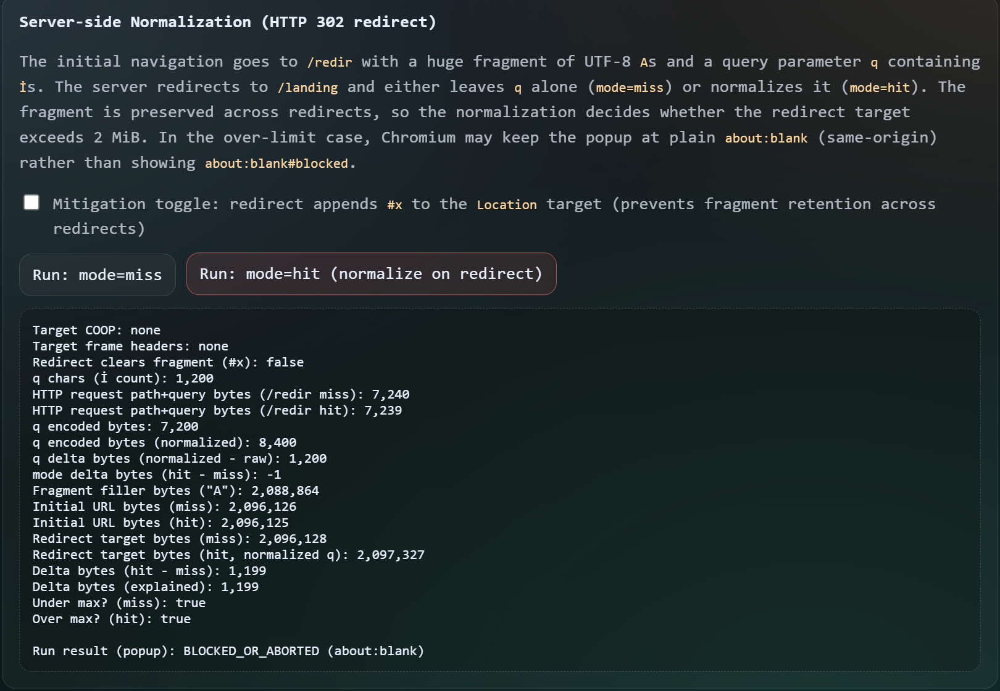
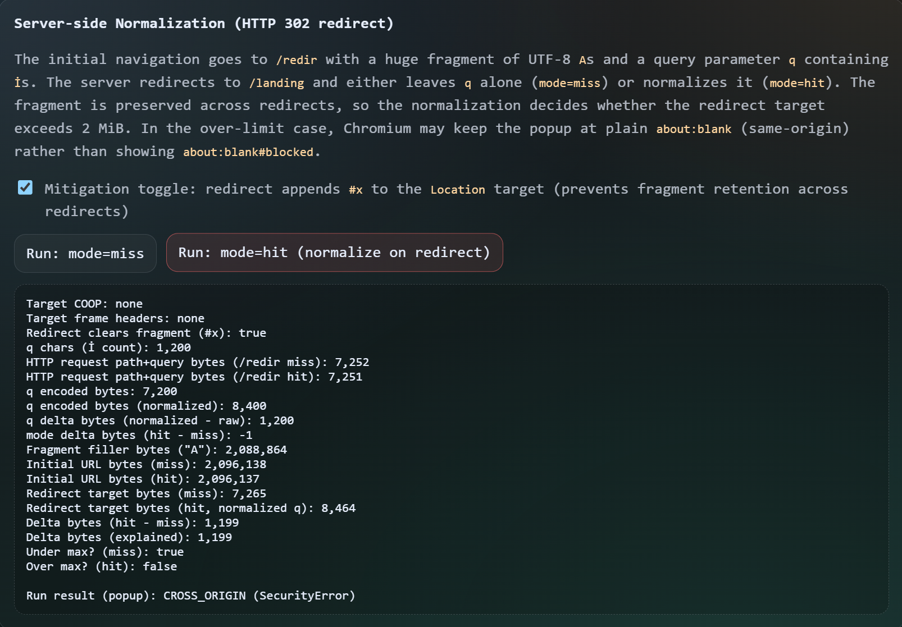

:::note[Ported from Medium]
This post was originally published on Medium. To read it there, go to
[the original article](https://medium.com/@randomguy6407/weaponizing-unicode-case-folding-and-url-inflation-to-create-a-new-xs-search-oracle-e60afdf573d3).
:::

XS-Search oracles utilize different methods to measure a HIT / MISS depending on
what the server returns alongside the mitigations in place, such as security
headers like Content-Security-Policy or X-Frame-Options. URL Inflation attacks
improve on this by using a browser constraint as a signal, but this requires the
server to naturally redirect to different length paths, which may not always be
present. This writeup will discuss about a novel but slightly rare gadget for URL
inflation attacks which is unicode case folding, and how it can be weaponized to
turn a simple mistake into a clean XS-Search oracle.

## How does this XS-Search oracle differ from other XS-Leaks techniques?

Most XS-Search oracles rely on timing differences, cache behaviour, or resource
loading side-effects. These oracles are more likely than not, really noisy and
potentially unreliable if the correct security headers are in place (for example:
`COOP: same-origin` + `X-Frame-Options: Deny` / `CSP frame-ancestors 'self'`
kills frame counting; Network Partitioning / `Cache-Control: no-cache` kills
cache-probing attacks.)

This oracle is unique in the sense that it utilizes Chromium's 2 MiB URL length
limit (exactly 2,097,152 bytes) alongside branch-dependent Unicode normalization
to create a highly reliable XS-Search oracle if the conditions are met. This
allows for side channel information leakage from improperly handling query
strings.

One thing to note is that this oracle does not work in Firefox, as instead of
redirecting to `about:blank#blocked` or `about:blank`, it simply refuses to
attempt to navigate and will throw a `DOMException` error. Therefore, it is
recommended to use a Chromium-based browser for these tests. (Since Microsoft
Edge is a Chromium-based browser, it is also vulnerable to this XS-Search.)

## Pre-requisites

1\) A branch-dependent Unicode normalization path, for example:

```js
const stuff = ['secret', 'secrets', 'token']
app.get('/search', (req, res) => {
  const search = req.query.q; // /search?q=secret
  let queryString = req.originalUrl.split('?')[1] ? `?${req.originalUrl.split('?')[1]}` : '';

  try {
    queryString = decodeURIComponent(queryString); // URL decode, since browsers send params URLencoded!
  } catch (e) {
    res.status(400).send('Malformed Query String');
    return;
  }
  // Note: browsers canonicalize the URL into UTF-8 bytes (percent-encoding non-ASCII) before navigating.
  // encodeURIComponent is not needed for percent-encoding non-ASCII, but is still recommended as it prevents structure injection.
  if (stuff.includes(search)) {
    res.redirect('/result' + queryString.toLowerCase()); // normalize everything
  } else {
    res.redirect('/404' + queryString);
  }
});
```

In this example, one outcome uses the `.toLowerCase()`, which means unicode
characters like the capital Turkish I (`İ`) will split into `i̇`, which,
when URL-encoded, expands the length of the URL by 1 byte, pushing it closer to
the 2 MiB limit that the Chromium browser enforces. (6 bytes as `%C4%B0` → 7
bytes as `i%CC%87`) [Note: it does not need to be purely `.toLowerCase()`,
`.toUpperCase()` also works with a different unicode character such as `ʼn`
(U+0149), which uppercases to `ʼN` (6 bytes as `%C5%89` → 7 bytes as `%CA%BCN`).
However, it would be a weird implementation to do so.]

2\) That branch-dependent Unicode normalization path will also need to URL-decode
and then make the entire URL lowercased. If this is not met, and the
implementation simply does `res.redirect(req.originalUrl.toLowerCase());`, it
will not see any `İ` since it has already been URL-encoded by the browser before
reaching the server.

## How this XS-Search oracle works

The attacker crafts a URL with the URI fragment being junk and adds unicode
characters which Unicode casefold upon uppercasing/lowercasing to the query
parameters (if the normalization happens server-side), or, more rarely, to the
URI fragment (if the normalization happens client-side via an HTML page).

When the attacker calls `window.open()` with this URL or makes an iframe
(depending on the security headers imposed), it will hit the branch-dependent
Unicode normalization path which determines whether the content in the URL will
get normalized or be kept constant:

HIT path: The URL will be normalized and the total length of the URL will now be
\>2 MiB. This triggers Chromium's maximum URL length limit and aborts the
navigation, and the location will be in `about:blank#blocked` (direct navigation)
or `about:blank` (for a server-side Location redirect), which we can measure
since `about:blank` shares the same origin as the document that opened it. If we
can access `w.document`, we know it is same-origin, which means it aborted the
navigation and went to `about:blank`.

MISS path: The browser will commit to the redirect since the total length of the
URL is <2 MiB. We can know the browser commits by trying to read `w.document`,
and if it throws a `SecurityError`, we will know it is cross-origin and the
navigation did not abort.

It is also to be noted that attackers will usually send ~1KB+ of Unicode in order
to account for path length differences. It does not require too much precision as
compared to regular URL inflation; however, you are still required to calculate
some values (such as the padding required in the URI fragment) so that both the
HIT and MISS outcomes will have differing effects. Below is a simple
representation of how the flow looks:



_The full attack flow: attacker navigates the victim window to a near-limit URL,
server-side normalization on a query hit expands the redirect target past 2 MiB,
Chromium aborts navigation, and the opener infers a hit from the window remaining
same-origin._

### Client-Side Normalization Variant (less common but better oracle if present)

In rare cases, an app might normalize a URI fragment client-side (e.g., for
case-insensitive anchors) by decoding and lowercasing via JavaScript, then
redirecting with `location.href`. If normalization becomes a branch-dependent
path (for example, applying on HIT and not MISS), attackers can put heavy amounts
of Unicode characters into the URI fragment so that a HIT will be easily
distinguishable no matter the length of the path.

One advantage of the client-side normalization variant is that the popup will
either end up cross-origin (easily measurable) or in `about:blank` with the
`#blocked` URI fragment, which makes it much easier to determine whether it has
been hit. Compared to server-side redirects, which only abort the navigation and
set it to be `about:blank` without the `#blocked` URI fragment.

### Server-Side Normalization Variant (more common but server limitations will apply)

More commonly, an app might normalize the URL query parameters by calling
`toLowerCase()` on the entire URL after URL decoding it, so the query parameters
will all be lowercased. Although this will be a bit weaker than the client-side
normalization variant, as you are subjected to server limitations which might
reject overly long URLs, it is much more practical than client-side
normalization.

One advantage of the server-side normalization variant is that it is
significantly faster than the client-side variant in detecting cross-origin
behaviour reliably (750ms for server-side HIT, 1500ms for client-side variant
HIT).

## Example PoC

You are able to find the Proof of Concept for this XS-Search oracle in my GitHub
(<https://github.com/randomguy6407/xssearch-normalization>). It includes
`demo-server.py` and the public folder, which contains the necessary HTML + JS
code to simulate a cross-origin side channel leak between 2 localhost websites.

So far, I believe that this will only work on Chromium-based browsers. For
example, Microsoft Edge has this issue since it is a Chromium browser. However,
Firefox outright blocks navigation by throwing a `DOMException` error when trying
to set `location.href`. Furthermore, from my testing, if you try to visit
`'http://example.com#' + 'A'.repeat(1_048_554)` via `location.href` or
`window.open` (increasing the A count by 1 more restricts you, throwing a
`DOMException: 'An invalid or illegal string was specified'` when using it via
`window.open()`), the browser will simply crash.

An interesting thing is that, when using Firefox ESR, the entire browser crashed
instead of just the tab spawned by `window.open()` crashing. However, using
Firefox for Windows made it so the tab spawned by `window.open()` shows the tab
crash reporter, and it is also in `about:blank`. I do not think you can do
anything meaningful with this, as the attacker will be met with a
`DOMException: 'Permission denied to access property "document" on cross-origin object'`,
despite the tab crash reporter supposedly being in `about:blank`.

For Safari, this is also not exploitable since I believe Safari handles URI
fragments differently. Even by placing 10 million characters in the URI fragment,
the website loaded normally. Note that in the Safari I tested using
`location.href`, the omnibox did not show any URI fragments. Unfortunately, as I
do not own an Apple device, I could not test this further. (I was using
BrowserStack's free plan.)

Note: Firefox 147.0.3 for Windows and Firefox ESR 140.5.0 in WSL were used for
this testing.



_firefox esr crash dialogue_



_firefox window tab crash (contents of document cannot be accessed due to
aforementioned error)_



_Server-side proof of concept with mode=hit, a popup will open with the final
location being about:blank_



_Server-side proof of concept mitigation using a redirect with '#x' being
appended to Location target._

## Mitigations

To mitigate this XS-Search oracle, you can employ several tactics:

1\) In the Location header for server-side Unicode normalization, you are able to
purge previous URI fragments and prevent them from being carried during the
redirect by setting it explicitly. However, do note that this will make anchors
non-functional since the user-supplied URI fragments will disappear.

2\) Navigation Isolation Policies can also be implemented to prevent this
XS-Search oracle by preventing cross-site `window.open()` navigations from
happening, which is what this XS-Leaks technique uses. However, be aware that
improper implementation of `Sec-Fetch*` headers can also break site
functionality. To also make sure this is effective, you can combine it with
framing protections like X-Frame-Options or Content-Security-Policy's
`frame-ancestors`. (For example, a cross-site anchor links to your page, but your
checks happen too strictly, hence something non-sensitive like reading a page
will be blocked.)

3\) Avoid branch-dependent Unicode normalization by normalizing before any
hit/miss logic and be consistent. Either both responses are returned with their
query parameters lowercased, or none of them are returned lowercased.
Additionally, you can further protect yourself from the base URL inflation
attacks simply by making both endpoints return the same path length and URL
parameter length.

An example of the fixed code using number 1 and 3 mitigations:

```js
const stuff = ['secret', 'secrets', 'token']
app.get('/search', (req, res) => {
  const search = req.query.q; // /search?q=secret
  let queryString = req.originalUrl.split('?')[1] ? `?${req.originalUrl.split('?')[1]}` : '';
  // normalization happens before HIT / MISS logic (mitigation number 3, however we did not use the mitigation of making both return the same path length)
  // In theory this should be vulnerable, but since there's no differing logic (both HIT and MISS gets the querystring to be lowercased), it is hence not vulnerable.
  try {
    queryString = decodeURIComponent(queryString).toLowerCase();
  } catch (e) {
    res.status(400).send('Malformed Query String');
    return;
  }
  // URL fragments are appended to overwrite whatever the user sent to eliminate both the oracle we discussed, as well as the underlying URL inflation technique documented in xsleaks.dev (mitigation number 1)
  if (stuff.includes(search)) {
    res.redirect('/result' + queryString + '#' + 'anything_for_clientside');
  } else {
    res.redirect('/404' + queryString + '#' + 'anything_for_clientside');
  }
});
```

## Resources

- [xsleaks.dev — Navigations: inflation & client-side errors](https://xsleaks.dev/docs/attacks/navigations/#inflation-client-side-errors)
  (URL inflation used as a standalone oracle)
- [xsleaks.dev — Navigation Isolation Policy](https://xsleaks.dev/docs/defenses/isolation-policies/navigation-isolation/)
  (Navigation Isolation Policy)
- [Chromium `url_constants.h`](https://chromium.googlesource.com/chromium/src/+/refs/heads/main/url/url_constants.h)
  (Constants defined, including the max URL length of exactly 2 MiB)
- [Unicode `SpecialCasing.txt`](https://www.unicode.org/Public/UCD/latest/ucd/SpecialCasing.txt)
  (Unicode SpecialCasing.txt, shows that U+0130 lowercase mapping to 0069 0307,
  you can also find similar characters which also unicode casefold in here)
- [Chromium URL display guidelines](https://chromium.googlesource.com/chromium/src/+/refs/heads/main/docs/security/url_display_guidelines/url_display_guidelines.md)
  (Documentation about URLs in chromium, also highlights the reason why chrome
  limits URLs to 2 MiB)
- [Firefox `nsStandardURL.cpp`](https://searchfox.org/mozilla-central/source/netwerk/base/nsStandardURL.cpp)
  (Firefox's `nsStandardURL::ParseURL` which enforces
  `network.standard-url.max-length` before processing any URL)
- [Firefox `StaticPrefList.yaml`](https://searchfox.org/mozilla-central/source/modules/libpref/init/StaticPrefList.yaml)
  (Firefox static prefs, `network.standard-url.max-length` defaults to 1,048,576
  bytes)
